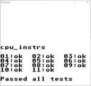

# gb-emu
Game Boy emulator written in Rust.

This uses boot rom of https://github.com/LIJI32/SameBoy.





## References
- Abstruct
  - https://gbdev.io/pandocs/
  - https://github.com/pokemium/gb-docs-ja (for japanese)
- MBC
  - https://gbdev.io/pandocs/MBCs.html
  - https://github.com/Hacktix/GBEDG/blob/master/mbcs/index.md
- CPU
  - http://marc.rawer.de/Gameboy/Docs/GBCPUman.pdf
  - https://github.com/AntonioND/giibiiadvance/blob/master/docs/TCAGBD.pdf
  - https://gekkio.fi/files/gb-docs/gbctr.pdf
  - https://izik1.github.io/gbops/index.html
- PPU
  - https://gbdev.io/pandocs/Rendering.html
  - https://github.com/Hacktix/GBEDG/blob/master/ppu/index.md
- APU
  - https://gbdev.io/pandocs/Audio.html
  - https://nightshade256.github.io/2021/03/27/gb-sound-emulation.html
- Timer
  - https://github.com/Hacktix/GBEDG/blob/master/timers/index.md
- Joypad
  - https://gbdev.io/pandocs/Joypad_Input.html
- OAM DMA transfer
  - https://gbdev.io/pandocs/OAM_DMA_Transfer.html
  - https://github.com/Hacktix/GBEDG/blob/master/dma/index.md

## Test suite

### [Blargg's tests](https://gbdev.gg8.se/files/roms/blargg-gb-tests/)

| Test         | gb-emu |
| ------------ | :----: |
| cpu instrs   | :+1:   |
| instr timing | :+1:   |
| mem timing   | :+1:   |
| mem timing 2 | :+1:   |
| halt bug     | :+1:   |
| oam bug      | :x:    |
| dmg sound    | :x:    |
| cgb sound    | :x:    |

## Status

- [ ] Catridge
    - [x] Catridge loading
    - [x] MBC1
    - [x] MBC3
    - [x] MBC5
    - [ ] Others
- [x] CPU
    - [x] Instructions
    - [x] Interrupt handling
- [x] PPU
    - [x] Background
    - [x] Window
    - [x] Sprite
    - [x] V-blank interrupt
    - [x] LCDC STAT interrupt
    - [x] Sprite and background priority
- [x] APU
  - [x] Channel1
    - [x] Envelope
    - [x] Sweep
  - [x] Channel2
    - [x] Envelope
  - [x] Channel3
  - [x] Channel4
    - [x] Envelope
- [x] Timer
    - [x] Timer registers
    - [x] Timer overflow interrupt
- [x] Joypad
    - [x] Joypad input
    - [x] Joypad interrupt
- [x] OAM DMA transfer
- [x] Saving game data

## gb-emu-web

```sh
wasm-pack build --target web --out-dir www/wasm
```